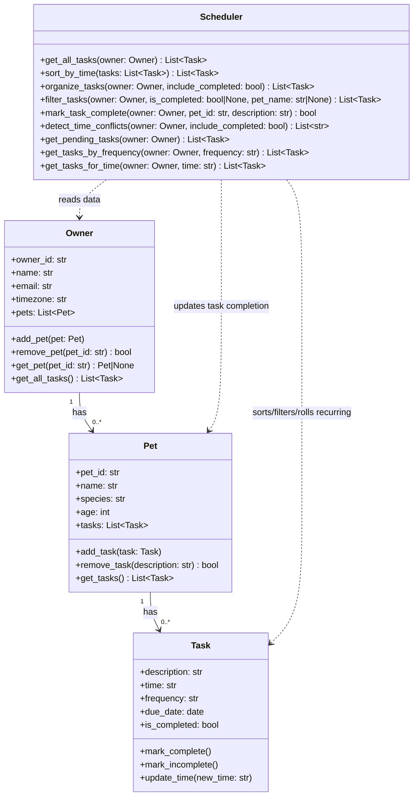

# PawPal+ Project Reflection

## 1. System Design

Core user actions the system should support:

- A user can add and manage a pet profile, including key details like the pet's name, type, age, and care preferences.
- A user can schedule a walk or care activity for a specific pet by choosing a date, time, and duration.
- A user can view today's tasks in one place to quickly understand what care activities are due and what should be done next.

Updated Mermaid class diagram:

**a. Initial design**

My initial design intentionally separated data from scheduling behavior. I started with an `Owner -> Pet -> Task` ownership chain and a scheduler service layer responsible for ordering and selecting tasks. The first UML was broader than the final code, but it helped define boundaries early: data classes should stay lightweight, while algorithmic logic belongs in one scheduler class.

**b. Design changes**

The biggest change was simplifying the model to exactly what exists in code: `Task`, `Pet`, `Owner`, and `Scheduler`.

I removed abstract planning classes and put scheduling behavior into concrete methods:

- `sort_by_time()` for deterministic ordering
- `filter_tasks()` for UI-driven views
- `mark_task_complete()` for recurring rollover
- `detect_time_conflicts()` for safety warnings

This reduced abstraction overhead and made the architecture easier to test and explain.

---

## 2. Scheduling Logic and Tradeoffs

**a. Constraints and priorities**

My scheduler currently uses these constraints:

- Time ordering (`HH:MM`) to make the plan actionable.
- Completion status to separate pending work from historical records.
- Pet-specific filtering so multi-pet owners can focus quickly.
- Recurrence rules (`daily`, `weekly`, `once`) to keep routines continuous.

I prioritized constraints that directly reduce owner friction in daily usage: seeing what is next, knowing what is done, and not having to manually recreate recurring tasks.

**b. Tradeoffs**

My scheduler detects conflicts only for exact same-time matches (for example, two tasks at `18:30`). It does not yet detect overlap windows because the task model does not include durations.

This is a deliberate simplification: it keeps conflict detection lightweight, predictable, and easy to communicate in the Streamlit UI while still providing practical safety alerts.

---

## 3. AI Collaboration

**a. How you used AI**

I used Copilot in three modes:

- Design support: refining the class boundaries and updating UML to match implementation.
- Algorithm support: iterating on sort/filter/recurrence/conflict methods.
- Verification support: generating targeted pytest cases and validating expected behavior.

The most effective prompts were specific and testable, such as:

- "How do I sort Task objects by `HH:MM` using a lambda key?"
- "Use `timedelta` to compute next due date for daily/weekly recurrence."
- "Suggest edge cases for conflict detection and no-task owners."

**b. Judgment and verification**

I rejected a more compact conflict algorithm that was shorter but less readable for beginners. I kept a clearer grouped-loop approach instead.

I verified the decision by:

- Running `pytest` after each change.
- Confirming warning outputs in both terminal and Streamlit UI.
- Checking that readability remained high for future maintenance.

Using separate chat sessions by phase helped me stay organized: one session for algorithm building, one for testing, and one for packaging/documentation. It reduced context drift and made each pass goal-driven.

---

## 4. Testing and Verification

**a. What you tested**

I tested:

- Task completion state changes.
- Pet task list mutation on add.
- Sorting correctness for out-of-order task times.
- Daily recurrence creation after marking complete.
- Conflict warning generation for duplicate times.
- Empty-owner/empty-task edge cases.

These tests protect the highest-value scheduler behaviors and prevent regressions in core planning logic.

**b. Confidence**

Current confidence is **4/5** based on passing automated tests and manual Streamlit checks.

If I had more time, I would add tests for:

- Weekly recurrence with custom due dates.
- Invalid time formats and how they appear in sorted views.
- Duplicate task descriptions for the same pet and completion targeting.
- Future support for duration overlaps instead of exact-time-only conflicts.

---

## 5. Reflection

**a. What went well**

I am most satisfied with the integration between backend logic and UI. The app now exposes smart behavior directly: filtered sorted schedules, recurring rollover, and actionable warnings.

**b. What you would improve**

In a next iteration, I would redesign `mark_task_complete()` to use a task ID instead of description matching. That would remove ambiguity when multiple tasks share the same description.

**c. Key takeaway**

My key takeaway is that AI works best as a force multiplier when I stay the lead architect. The best results came from setting clear constraints, validating outputs with tests, and choosing readability over cleverness when maintaining a learning-focused codebase.
