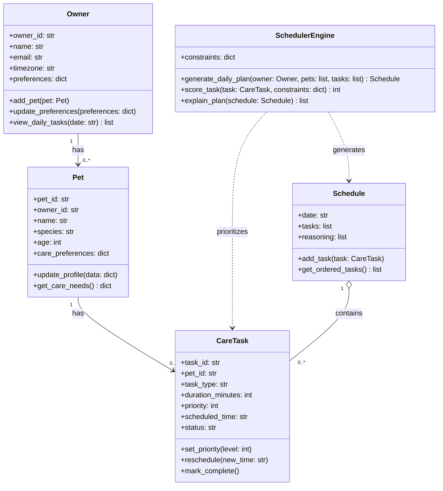

# PawPal+ Project Reflection

## 1. System Design

Core user actions the system should support:

- A user can add and manage a pet profile, including key details like the pet's name, type, age, and care preferences.
- A user can schedule a walk or care activity for a specific pet by choosing a date, time, and duration.
- A user can view today's tasks in one place to quickly understand what care activities are due and what should be done next.

Updated Mermaid class diagram:

**a. Initial design**

My initial UML design focused on the minimum set of classes needed to satisfy the project requirements while keeping responsibilities clear.

Classes and responsibilities:

- `Owner`: stores owner profile and preferences, and acts as the entry point for viewing daily tasks.
- `Pet`: stores pet profile data and care preferences (species, age, and care needs).
- `CareTask`: represents individual care items (walk, feed, meds, etc.) with duration, priority, schedule time, and completion status.
- `Schedule`: holds the generated daily plan as an ordered list of tasks plus short reasoning notes.
- `SchedulerEngine`: applies constraints and priorities to score tasks, produce a daily plan, and explain why tasks were ordered the way they were.

This design separates data objects (`Pet`, `CareTask`, `Schedule`) from decision logic (`SchedulerEngine`) so scheduling behavior can evolve without changing the core data model.

**b. Design changes**

Yes, the design changed after AI-assisted review.

What feedback identified:

- Potential over-complexity: the earlier model included extra classes (for example reminders/logging) that were useful but not required for the module goals.
- Potential logic bottleneck: too much scheduling behavior risked being split between `Schedule` and `SchedulerEngine`, which could cause duplicated conflict logic and harder debugging.
- Relationship gap: the key ownership chain needed to stay explicit and central (`Owner -> Pet -> CareTask`) so task responsibility is always clear.

What I changed and why:

- I simplified to a requirement-aligned core: `Owner`, `Pet`, `CareTask`, `Schedule`, and `SchedulerEngine`.
- I moved planning logic responsibility fully into `SchedulerEngine` and kept `Schedule` as a lightweight container for ordered tasks and reasoning.
- I kept the essential relationships explicit in UML (`Owner has Pets`, `Pet has CareTasks`, `Schedule contains CareTasks`) to reduce ambiguity and support cleaner implementation.

These updates made the model easier to implement and test, while still covering all required features (owner/pet input, task management, schedule generation, and plan explanation).

---

## 2. Scheduling Logic and Tradeoffs

**a. Constraints and priorities**

- What constraints does your scheduler consider (for example: time, priority, preferences)?
- How did you decide which constraints mattered most?

**b. Tradeoffs**

- Describe one tradeoff your scheduler makes.
- Why is that tradeoff reasonable for this scenario?

---

## 3. AI Collaboration

**a. How you used AI**

- How did you use AI tools during this project (for example: design brainstorming, debugging, refactoring)?
- What kinds of prompts or questions were most helpful?

**b. Judgment and verification**

- Describe one moment where you did not accept an AI suggestion as-is.
- How did you evaluate or verify what the AI suggested?

---

## 4. Testing and Verification

**a. What you tested**

- What behaviors did you test?
- Why were these tests important?

**b. Confidence**

- How confident are you that your scheduler works correctly?
- What edge cases would you test next if you had more time?

---

## 5. Reflection

**a. What went well**

- What part of this project are you most satisfied with?

**b. What you would improve**

- If you had another iteration, what would you improve or redesign?

**c. Key takeaway**

- What is one important thing you learned about designing systems or working with AI on this project?
